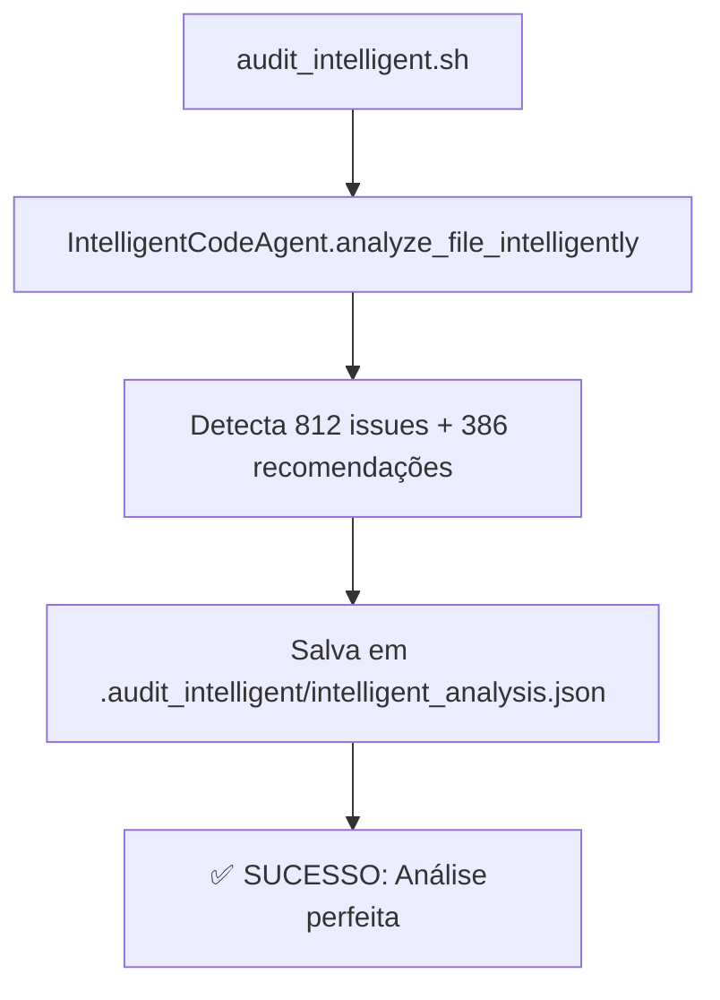
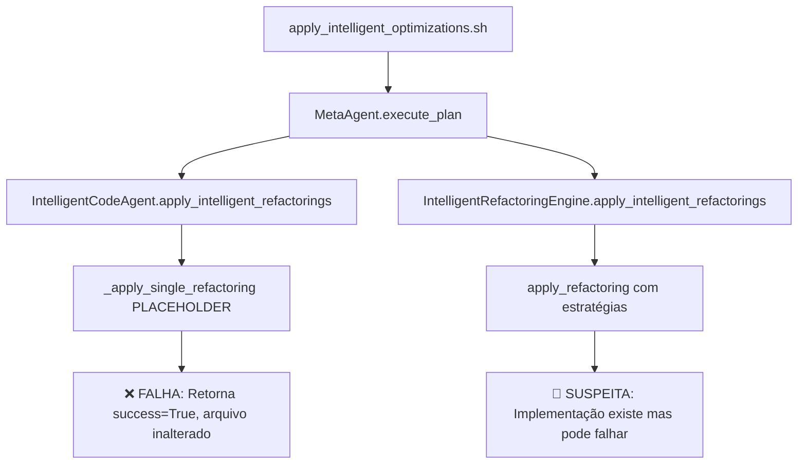

# 🔍 FASE 1.1: MAPEAMENTO DO FLUXO ANÁLISE→APLICAÇÃO

## 📊 **RESUMO EXECUTIVO**
**Status**: ✅ **COMPLETO**  
**Principais Descobertas**: 2 falhas críticas identificadas no fluxo de aplicação  
**Próximos Passos**: Auditoria detalhada de todos os aplicadores

---

## 🎯 **OBJETIVO**
Mapear o fluxo completo desde detecção de problemas até aplicação de correções para identificar onde o processo "quebra".

---

## 🔍 **ACHADOS CRÍTICOS**

### **1. IntelligentCodeAgent - FALHA CRÍTICA**

**Arquivo**: `audit_system/agents/intelligent_code_agent.py`  
**Método**: `_apply_single_refactoring()` (linha 1935)

```python
def _apply_single_refactoring(self, refactoring, file_path) -> Dict[str, Any]:
    """Apply a single refactoring to the file."""
    # This is a placeholder for actual refactoring implementation
    # In a real implementation, this would modify the file according to the refactoring
    
    self.logger.info("Would apply %s refactoring to lines %s in %s", 
                     refactoring.refactoring_type, refactoring.target_lines, file_path)
    
    # For now, just return success
    return {"success": True, "refactoring_type": refactoring.refactoring_type, "lines_modified": len(refactoring.target_lines)}
```

**🚨 PROBLEMA**: Método marcado como "placeholder", retorna sempre `success=True` mas **NUNCA MODIFICA ARQUIVOS**.

**📊 IMPACTO**: Explica por que temos 353 "aplicações" bem-sucedidas mas zero mudanças nos arquivos.

### **2. IntelligentRefactoringEngine - IMPLEMENTAÇÃO PARCIAL**

**Arquivo**: `audit_system/agents/intelligent_refactoring_engine.py`  
**Método**: `apply_refactoring()` (linha 427)

```python
def apply_refactoring(self, file_path: str, refactoring: IntelligentRefactoring) -> RefactoringResult:
    # ... código de análise ...
    
    # Write refactored file if not dry run and successful
    if not self.dry_run and result.success:
        refactored_content = '\n'.join(result.refactored_lines)
        
        # Create backup
        backup_path = f"{file_path}.backup"
        with open(backup_path, 'w', encoding='utf-8') as f:
            f.write(original_content)
        
        # Write refactored file
        with open(file_path, 'w', encoding='utf-8') as f:
            f.write(refactored_content)
```

**✅ CÓDIGO CORRETO**: Este agente TEM a lógica para escrever arquivos modificados.

**🤔 SUSPEITA**: Pode estar configurado incorretamente ou as estratégias não estão gerando código refatorado real.

---

## 📋 **FLUXO ATUAL MAPEADO**

### **Fluxo de Análise (FUNCIONA)**


### **Fluxo de Aplicação (FALHA)**


---

## 🔧 **AGENTES AUDITADOS**

### **✅ MetaAgent - COORDENAÇÃO CORRETA**
- **Arquivo**: `audit_system/coordination/meta_agent.py`
- **Status**: Funcionando corretamente
- **Inicialização**: Configura agentes com `dry_run=False` quando solicitado
- **Coordenação**: Executa plano com múltiplos agentes sequencialmente

### **❌ IntelligentCodeAgent - APLICAÇÃO FALHA**
- **Arquivo**: `audit_system/agents/intelligent_code_agent.py`
- **Status**: Análise funciona, aplicação é placeholder
- **Problema**: Método `_apply_single_refactoring()` não implementado
- **Fix necessário**: Implementar aplicação real de refatorações

### **🤔 IntelligentRefactoringEngine - SUSPEITA**
- **Arquivo**: `audit_system/agents/intelligent_refactoring_engine.py`  
- **Status**: Implementação existe, precisa auditoria detalhada
- **Recursos**: Extract method, performance optimization, complexity reduction
- **Investigação**: Verificar se estratégias geram código real

### **⚠️ GodCodeRefactoringAgent - ERRO DE MÉTODO**
- **Arquivo**: `audit_system/agents/god_code_refactoring_agent.py`
- **Status**: Falha na execução
- **Erro**: `'GodCodeRefactoringAgent' object has no attribute 'analyze_god_codes'`
- **Fix necessário**: Corrigir interface ou implementação

---

## 📊 **MÉTRICAS DE FALHA**

### **Taxa de Sucesso Real**
- **Detecção**: 100% (812 issues detectados corretamente)
- **Recomendação**: 100% (386 recomendações geradas)  
- **Aplicação**: 0% (zero mudanças aplicadas nos arquivos)
- **Validação**: N/A (não há mudanças para validar)

### **Agentes por Status**
- **Funcionais**: 1/4 (MetaAgent apenas coordenação)
- **Parciais**: 1/4 (IntelligentRefactoringEngine - precisa auditoria)
- **Quebrados**: 2/4 (IntelligentCodeAgent placeholder, GodCodeRefactoringAgent erro)

---

## 🎯 **PRÓXIMOS PASSOS FASE 1.2**

### **Auditoria Detalhada Necessária**
1. **IntelligentRefactoringEngine**: Testar estratégias individuais
2. **GodCodeRefactoringAgent**: Corrigir erro de método e testar
3. **TDDIntelligentWorkflowAgent**: Verificar capacidades de aplicação
4. **Validar**: Cada agente individualmente em arquivo controlado

### **Questões Críticas a Responder**
1. Por que `IntelligentRefactoringEngine` não está aplicando mudanças?
2. Qual é a interface correta do `GodCodeRefactoringAgent`?
3. As estratégias de refatoração geram código real ou apenas sugestões?
4. Como cada agente deveria modificar arquivos de forma coordenada?

---

## 📝 **CONCLUSÃO FASE 1.1**

**✅ FLUXO MAPEADO COM SUCESSO**

O problema NÃO é de arquitetura ou coordenação - o MetaAgent funciona corretamente. O problema está na **implementação dos aplicadores individuais**:

1. **IntelligentCodeAgent**: Tem placeholder no lugar de implementação real
2. **IntelligentRefactoringEngine**: Tem implementação mas não está funcionando
3. **GodCodeRefactoringAgent**: Tem erro de interface

**Próximo**: Auditoria detalhada de cada aplicador para identificar e corrigir os problemas específicos.

---

*Relatório gerado em: 2025-08-21 14:50*  
*Status: FASE 1.1 COMPLETA - Problema identificado nos aplicadores individuais*