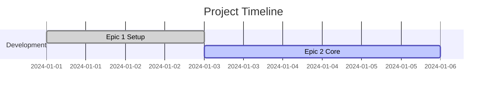

# 📄 GitHub Pages Setup Guide - TDD Project Template

Complete guide to set up GitHub Pages for your TDD project with automated dashboard updates.

## 📋 Table of Contents

1. [Quick Setup](#quick-setup)
2. [Configuration Files](#configuration-files)
3. [Customization](#customization)
4. [Automation Setup](#automation-setup)
5. [Troubleshooting](#troubleshooting)

---

## 🚀 Quick Setup

### Step 1: Enable GitHub Pages

1. Go to your repository **Settings**
2. Scroll to **Pages** section
3. Set **Source** to: `GitHub Actions`
4. Branch will be managed automatically by workflows

### Step 2: Copy Template Files

Copy these files from the template to your project:

```bash
# Core GitHub Pages files
docs/_config.yml          # Jekyll configuration
docs/index.md             # Landing page
docs/Gemfile              # Ruby dependencies

# Automation
.github/workflows/tdd-automation.yml  # Auto-update workflow
```

### Step 3: Customize Configuration

Edit `docs/_config.yml` and replace placeholders:

```yaml
# Replace these placeholders
title: "[PROJECT_NAME] - TDD Dashboard"
url: "https://[USERNAME].github.io"
baseurl: "/[REPOSITORY_NAME]"

author:
  name: "[AUTHOR_NAME]"
  email: "[AUTHOR_EMAIL]"

github:
  repository_url: https://github.com/[USERNAME]/[REPOSITORY_NAME]
  repository_name: [USERNAME]/[REPOSITORY_NAME]
```

### Step 4: Enable Workflow Permissions

1. Go to **Settings** → **Actions** → **General**
2. Set **Workflow permissions** to: `Read and write permissions`
3. Check ✅ `Allow GitHub Actions to create and approve pull requests`

---

## 🛠️ Configuration Files

### `docs/_config.yml`

Complete Jekyll configuration for TDD projects:

```yaml
# Basic site settings
title: "Your TDD Project - Dashboard"
description: "TDD project with automated epic tracking"
url: "https://yourusername.github.io"
baseurl: "/your-repo-name"

# Theme and plugins
theme: minima
plugins:
  - jekyll-feed
  - jekyll-sitemap
  - jekyll-seo-tag

# TDD Dashboard features
tdd_dashboard:
  show_gantt_chart: true
  show_epic_progress: true
  show_phase_distribution: true
  auto_refresh_minutes: 5

# Mermaid diagram support
mermaid:
  enabled: true
  theme: default
```

### `docs/Gemfile`

Ruby dependencies for GitHub Pages:

```ruby
source "https://rubygems.org"

gem "github-pages", group: :jekyll_plugins
gem "jekyll", "~> 3.9.0"
gem "minima"
gem "jekyll-feed"
gem "jekyll-sitemap"
gem "jekyll-seo-tag"

# Optional: for advanced features
gem "jekyll-mermaid"
gem "jekyll-github-metadata"
```

### `docs/index.md`

Main landing page template:

```markdown
---
layout: default
title: Your Project - TDD Dashboard
description: Real-time TDD progress tracking
---

# 🎯 Your Project Name

> TDD methodology with automated epic management

## 📊 Live Dashboard

[View Progress Tracker →](./gantt_progress.html)

## 📋 Current Timeline



<!-- More content here -->
```

---

## 🎨 Customization

### Brand Colors & Styling

Create `docs/_sass/custom.scss`:

```scss
// TDD Phase Colors
$red-phase: #ff5252;    // Red phase
$green-phase: #4caf50;  // Green phase  
$refactor-phase: #2196f3; // Refactor phase

// Custom header styling
.site-header {
  background-color: #1976d2;
  
  .site-title {
    color: white !important;
  }
}

// Dashboard metrics cards
.metrics-grid {
  display: grid;
  grid-template-columns: repeat(auto-fit, minmax(200px, 1fr));
  gap: 20px;
  margin: 20px 0;
}

.metric-card {
  padding: 15px;
  border-radius: 8px;
  text-align: center;
  
  &.red-phase { background: #ffebee; }
  &.green-phase { background: #e8f5e8; }
  &.refactor-phase { background: #e3f2fd; }
}
```

### Navigation Menu

Add pages to `_config.yml`:

```yaml
header_pages:
  - index.md
  - about.md
  - epics.md
  - guides.md
```

### Custom Layouts

Create `docs/_layouts/epic.html`:

```html
---
layout: default
---

<article class="epic-page">
  <header>
    <h1>{{ page.title }}</h1>
    <p>Epic ID: {{ page.epic_id }}</p>
    <p>Status: {{ page.status }}</p>
  </header>
  
  <div class="epic-content">
    {{ content }}
  </div>
  
  <footer class="epic-meta">
    <p>Estimated: {{ page.estimated_hours }}h</p>
    <p>Progress: {{ page.progress }}%</p>
  </footer>
</article>
```

---

## 🔄 Automation Setup

### GitHub Actions Workflow

The `tdd-automation.yml` workflow automatically:

1. **Generates Diagrams** when epic JSON files change
2. **Updates GitHub Pages** with new visualizations  
3. **Creates Progress Reports** with analytics
4. **Deploys Site** using official GitHub Actions

Key workflow triggers:

```yaml
on:
  push:
    paths:
      - 'epics/*.json'        # Epic files
      - 'epic_*.json'         # Legacy format
      - 'generate_all_diagrams.py'
      - '.github/workflows/tdd-automation.yml'
  
  issues:
    types: [opened, closed, labeled]
    
  milestone:
    types: [created, closed, edited]
```

### Required Permissions

Ensure workflow has these permissions:

```yaml
permissions:
  contents: write          # For automatic commits
  issues: read            # For reading Issues  
  repository-projects: read # For reading Projects
  pages: write            # For GitHub Pages deploy
  id-token: write         # For Pages authentication
```

### Environment Variables

Set these in your repository settings if needed:

- `GITHUB_TOKEN` (automatically provided)
- `CUSTOM_DOMAIN` (if using custom domain)

---

## 🐛 Troubleshooting

### Common Issues

#### 1. **GitHub Pages Not Building**

**Problem**: Site shows 404 or build fails

**Solutions**:
```bash
# Check workflow status
Visit: https://github.com/[USER]/[REPO]/actions

# Verify Gemfile
source "https://rubygems.org"
gem "github-pages", group: :jekyll_plugins

# Check _config.yml syntax  
ruby -yaml -e "puts YAML.load_file('_config.yml')"
```

#### 2. **Mermaid Diagrams Not Rendering**

**Problem**: Diagrams show as code blocks

**Solutions**:
```yaml
# Add to _config.yml
mermaid:
  enabled: true

# Add to layout
<script src="https://cdn.jsdelivr.net/npm/mermaid@10.9.1/dist/mermaid.min.js"></script>
<script>
  mermaid.initialize({ startOnLoad: true });
</script>
```

#### 3. **Workflow Permission Denied**

**Problem**: Actions can't commit changes

**Solution**:
1. Go to **Settings** → **Actions** → **General**
2. Set **Workflow permissions**: `Read and write permissions`
3. Enable: `Allow GitHub Actions to create and approve pull requests`

#### 4. **Custom Domain Issues**

**Problem**: Custom domain not working

**Solutions**:
```bash
# Add CNAME file to docs/
echo "yourdomain.com" > docs/CNAME

# Update _config.yml
url: "https://yourdomain.com"
baseurl: ""  # Empty for custom domain
```

#### 5. **Broken Links After Deployment**

**Problem**: Links return 404 in production

**Solution**:
```markdown
# Use Jekyll's url helpers
[Link]({{ "/path/to/page" | relative_url }})

# Or site variables  
[Repo]({{ site.github.repository_url }})
```

### Debug Commands

```bash
# Local testing
bundle exec jekyll serve --watch --drafts

# Build without serving
bundle exec jekyll build

# Check for issues
bundle exec jekyll doctor
```

### Getting Help

If issues persist:

1. **Check GitHub Status**: https://www.githubstatus.com/
2. **Workflow Logs**: Repository → Actions → Failed workflow → View logs
3. **Jekyll Docs**: https://jekyllrb.com/docs/github-pages/
4. **Template Issues**: https://github.com/[TEMPLATE-REPO]/issues

---

## 📚 Advanced Configuration

### Analytics Integration

```yaml
# _config.yml
google_analytics: GA_TRACKING_ID
```

### SEO Optimization

```yaml
# _config.yml  
plugins:
  - jekyll-seo-tag

defaults:
  - scope:
      path: ""
    values:
      image: /assets/og-image.png
```

### Performance Optimization

```yaml
# _config.yml
sass:
  style: compressed

liquid:
  error_mode: warn
  strict_filters: false
  strict_variables: false

exclude:
  - node_modules/
  - vendor/
  - .sass-cache/
  - .jekyll-cache/
```

---

## ✅ Checklist

### Initial Setup
- [ ] GitHub Pages enabled with "GitHub Actions" source
- [ ] Template files copied and customized
- [ ] Workflow permissions configured  
- [ ] First epic JSON files created

### Customization
- [ ] Site title and description updated
- [ ] Author information configured
- [ ] Repository URLs updated
- [ ] Brand colors and styling applied

### Testing
- [ ] Site builds successfully locally
- [ ] Workflows run without errors
- [ ] Diagrams render correctly
- [ ] All links work in production

### Go Live
- [ ] Domain configured (if custom)
- [ ] Analytics setup (if needed)
- [ ] SEO metadata configured
- [ ] Team members have access

---

**🎉 Your TDD project dashboard is now live!**

Visit: `https://[USERNAME].github.io/[REPOSITORY_NAME]`