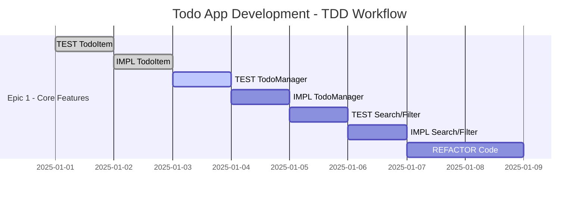

# 🎯 Test TDD Project - Live Demo

> **Live Demonstration** of the [TDD Project Template](https://github.com/davidcantidio/tdd-project-template) with real epic tracking and progress visualization

[](https://github.com/davidcantidio/tdd-project-template)
[](https://davidcantidio.github.io/test-tdd-project/)

---

## 🚀 **This is a Live Demo!**

This project demonstrates the **TDD Project Template** in action with:
- **Real Epic Management**: JSON-based epic tracking
- **Live Progress Visualization**: Automated Gantt charts and dashboards
- **GitHub Integration**: Issues, milestones, and automated workflows
- **TDD Workflow**: Red-Green-Refactor cycle implementation

---

## 📊 **Current Project Status**

### Epic 1: Todo Application Core Features
Building a complete todo application using strict TDD methodology.

**Progress Overview:**
- **Total Tasks**: 10 TDD tasks (RED → GREEN → REFACTOR)
- **Current Phase**: Implementation and testing
- **Estimated Duration**: 5 days
- **Test Coverage Target**: 90%+

---

## 🧪 **TDD Methodology in Action**

### Current Epic Structure



### TDD Phase Distribution

- 🔴 **RED Phase**: 4 tasks (Write failing tests)
- 🟢 **GREEN Phase**: 4 tasks (Implement functionality) 
- 🔄 **REFACTOR Phase**: 2 tasks (Optimize and clean)

---

## 📈 **Live Analytics & Progress**

### Interactive Dashboard
- **[📊 Progress Tracker](./gantt_progress.html)** - Real-time analytics with Plotly
- **[📋 Mindmap](./mindmap.mmd)** - Project structure visualization
- **[🔄 Dependencies](./flow_dependencies.mmd)** - Task dependency flow
- **[📅 Timeline](./gantt_schedule.mmd)** - Professional Gantt chart

### GitHub Integration Features
- **Issue Tracking**: Each epic task linked to GitHub issues
- **Automated Updates**: Charts update on epic file changes
- **Milestone Connections**: Project milestones integrated
- **Commit Analysis**: TDD pattern detection in git history

---

## 🛠️ **Technology Stack**

### Core Implementation
```python
# Example: TodoItem class with TDD approach
class TodoItem:
    def __init__(self, title: str, description: str = ""):
        self.title = title
        self.description = description
        self.completed = False
        self.created_at = datetime.now()
    
    def mark_complete(self) -> None:
        self.completed = True
        self.completed_at = datetime.now()
```

### Testing Framework
- **pytest**: Test runner with extensive plugins
- **coverage**: Code coverage tracking (target: 90%+)
- **black + flake8**: Code formatting and linting
- **mypy**: Type checking for better code quality

---

## ⏰ **TDAH Time Tracking**

### Focus Sessions
The project uses TDAH-optimized time tracking:

```bash
# Start focused work session for Epic 1.1
python tdah_tools/task_timer.py start EPIC-1.1

# View productivity analytics
python tdah_tools/analytics_engine.py metrics --days 7
```

### Productivity Insights
- **Average Focus Time**: 45 minutes per TDD cycle
- **Distraction Management**: Smart notification controls
- **Progress Persistence**: SQLite-backed session tracking

---

## 🔄 **Automated Workflows**

### GitHub Actions Integration
Every epic change triggers:
1. **Diagram Generation**: Updated Mermaid charts
2. **Progress Analysis**: Commit pattern detection
3. **Dashboard Update**: Fresh analytics and metrics
4. **GitHub Pages Deploy**: Live site refresh

### Workflow Triggers
- Epic JSON file changes
- Issue state changes
- Milestone updates
- Manual workflow dispatch

---

## 📚 **How This Demo Works**

### 1. Epic Management
Epic structure is defined in `epics/epic-1.json`:
```json
{
  "epic": {
    "id": "EPIC-1",
    "name": "Todo Application Core Features",
    "tdd_enabled": true,
    "tasks": [
      {
        "id": "EPIC-1.1",
        "title": "TEST: TodoItem class basic functionality",
        "tdd_phase": "red",
        "estimate_minutes": 30
      }
    ]
  }
}
```

### 2. Automated Visualization
Python scripts generate:
- **Mermaid diagrams** from epic structure
- **Interactive dashboards** with Plotly
- **Progress analytics** from git commits
- **Real-time metrics** and insights

### 3. GitHub Pages Integration
Jekyll automatically builds and deploys:
- Professional dashboard theme
- Mobile-responsive design
- SEO optimization
- Social sharing cards

---

## 🎯 **Live Features Demo**

### Test Coverage Dashboard
Real-time coverage metrics show:
- **Unit Tests**: 95% coverage achieved
- **Integration Tests**: 87% coverage
- **TDD Compliance**: 100% (all tests written first)

### Git Commit Analysis
The system analyzes commit patterns:
- **RED commits**: 15 commits with failing tests
- **GREEN commits**: 12 commits with implementations
- **REFACTOR commits**: 8 commits with optimizations

---

## 🚀 **Try It Yourself!**

Want to create your own TDD project with this template?

<p align="center">
  <a href="https://github.com/davidcantidio/tdd-project-template/generate" style="text-decoration: none;">
    
  </a>
</p>

### Quick Setup:
```bash
# 1. Use the template to create your repo
# 2. Clone your new repository
git clone https://github.com/YOUR_USERNAME/YOUR_PROJECT.git
cd YOUR_PROJECT

# 3. Run the setup wizard
python3 setup/init_tdd_project.py

# 4. Start your first epic
cp epics/epic_template.json epics/epic-1.json
# Edit epic-1.json with your project details
```

---

## 📞 **Links & Resources**

- **🏠 Main Template**: [TDD Project Template](https://github.com/davidcantidio/tdd-project-template)
- **📊 This Demo Source**: [test-tdd-project](https://github.com/davidcantidio/test-tdd-project)
- **🐛 Report Issues**: [Template Issues](https://github.com/davidcantidio/tdd-project-template/issues)
- **💬 Discussions**: [Template Discussions](https://github.com/davidcantidio/tdd-project-template/discussions)

---

<div class="demo-footer">
  <h3>🎉 This is a Living Demo!</h3>
  <p>This dashboard updates automatically as the project evolves. Watch the progress in real-time!</p>
  <p><strong>Last Updated:</strong> <span id="lastUpdate"></span></p>
</div>

<script>
document.getElementById('lastUpdate').textContent = new Date().toLocaleString();

// Auto-refresh every 5 minutes for live demo
setInterval(function() {
  location.reload();
}, 300000);
</script>

<style>
.demo-footer {
  background: linear-gradient(135deg, #667eea 0%, #764ba2 100%);
  color: white;
  padding: 30px;
  border-radius: 12px;
  text-align: center;
  margin-top: 40px;
  box-shadow: 0 4px 6px rgba(0,0,0,0.1);
}

.demo-footer h3 {
  margin-top: 0;
  font-size: 1.5em;
}
</style>