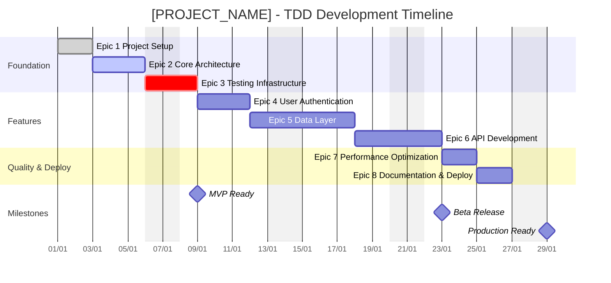

# 🎯 [PROJECT_NAME] - TDD Project Dashboard

> **Test-Driven Development** project with automated epic management, real-time progress tracking, and interactive visualizations.

## 📊 Interactive Dashboards

### [🎮 Progress Tracker →](./gantt_progress.html) | [📋 Epic Overview →](./progress_summary.md)

Real-time TDD dashboard featuring:
- **Epic Progress Tracking** with completion percentages
- **TDD Phase Distribution** (Red → Green → Refactor)
- **Time Accuracy Analytics** (estimated vs actual)
- **Focus Quality Metrics** for TDAH optimization
- **Interactive Mermaid Diagrams** with GitHub integration

---

## 📋 Project Timeline (Live Gantt)

> This timeline is automatically generated from epic JSON files and updated via GitHub Actions.



---

## 🧪 TDD Methodology

### **Red-Green-Refactor Cycle**
```
🔴 RED    → Write failing tests
🟢 GREEN  → Make tests pass (minimal code)
🔄 REFACTOR → Improve design (tests stay green)
```

### **📊 Current Phase Distribution**
- **🔴 Red Phase**: Write comprehensive tests first
- **🟢 Green Phase**: Implement minimal working code
- **🔄 Refactor Phase**: Optimize design and structure
- **📊 Analysis Phase**: Research and planning

### **🎯 Quality Gates**
- **Test Coverage**: Minimum 90%
- **Cyclomatic Complexity**: Maximum 10 per function
- **Test Execution Time**: Maximum 30 seconds
- **Code Duplication**: Maximum 5%

---

## 📈 Project Statistics

### **Development Excellence**
- ✅ **TDD Methodology**: Rigorous Red-Green-Refactor cycles
- ✅ **Epic-Based Planning**: Structured task breakdown
- ✅ **Automated Tracking**: Real-time progress updates
- ✅ **Quality Assurance**: Comprehensive testing strategy

### **Team Productivity** 
- ✅ **TDAH Optimization**: Focus-friendly time tracking
- ✅ **Standardized Commits**: Consistent development workflow
- ✅ **Automated Visualizations**: Live project dashboards
- ✅ **Documentation**: Self-updating project docs

### **Technical Achievement**
- ✅ **GitHub Integration**: Issues, milestones, and automation
- ✅ **CI/CD Pipeline**: Automated testing and deployment
- ✅ **Interactive Diagrams**: Mermaid-powered visualizations
- ✅ **Progress Analytics**: Data-driven insights

---

## 🛠️ Technologies & Tools

| Component | Technology | Purpose |
|-----------|------------|---------|
| **Planning** | Epic JSON + Templates | Structured task management |
| **Testing** | pytest/jest + Coverage | TDD implementation |
| **Tracking** | SQLite + Analytics | Time and progress monitoring |
| **Visualization** | Mermaid + Plotly | Interactive dashboards |
| **CI/CD** | GitHub Actions | Automated workflows |
| **Documentation** | Jekyll + GitHub Pages | Live project website |

---

## 🚀 Quick Start

### **For Developers:**
1. **Clone Repository**
   ```bash
   git clone https://github.com/[USERNAME]/[REPOSITORY_NAME].git
   cd [REPOSITORY_NAME]
   ```

2. **Setup Environment**
   ```bash
   # Python projects
   pip install -r requirements.txt
   pytest --cov
   
   # Node.js projects  
   npm install
   npm test
   ```

3. **Start TDD Workflow**
   ```bash
   # Use timer for focus tracking
   python -m tdah_tools.task_timer start EPIC-1.1
   
   # Follow Red-Green-Refactor cycle
   # 1. Write failing test
   # 2. Make it pass
   # 3. Refactor
   ```

### **For Project Managers:**
- **📊 [Progress Dashboard](./gantt_progress.html)** - Detailed metrics and analytics
- **📋 [Epic Overview](./progress_summary.md)** - High-level project status  
- **🎯 [GitHub Milestones](https://github.com/[USERNAME]/[REPOSITORY_NAME]/milestones)** - Release planning
- **🐛 [Issues Board](https://github.com/[USERNAME]/[REPOSITORY_NAME]/issues)** - Task tracking

---

## 📚 Documentation & Guides

- **[Setup Guide](./setup_guide.md)** - Complete project setup instructions
- **[TDD Guidelines](./tdd_guidelines.md)** - Development methodology details
- **[Epic Management](./epic_management.md)** - How to create and manage epics
- **[Troubleshooting](./troubleshooting.md)** - Common issues and solutions

---

## 📊 Live Project Metrics

<div class="metrics-grid" style="display: grid; grid-template-columns: repeat(auto-fit, minmax(200px, 1fr)); gap: 20px; margin: 20px 0;">
  <div style="padding: 15px; background: #e8f5e8; border-radius: 8px; text-align: center;">
    <strong>🎯 Active Epics</strong><br>
    <span style="font-size: 24px; color: #2e7d32;">[ACTIVE_EPICS_COUNT]</span>
  </div>
  
  <div style="padding: 15px; background: #e3f2fd; border-radius: 8px; text-align: center;">
    <strong>✅ Completed Tasks</strong><br>
    <span style="font-size: 24px; color: #1976d2;">[COMPLETED_TASKS_COUNT]</span>
  </div>
  
  <div style="padding: 15px; background: #fff3e0; border-radius: 8px; text-align: center;">
    <strong>⏱️ Total Time</strong><br>
    <span style="font-size: 24px; color: #f57c00;">[TOTAL_TIME_HOURS]h</span>
  </div>
  
  <div style="padding: 15px; background: #fce4ec; border-radius: 8px; text-align: center;">
    <strong>📈 Test Coverage</strong><br>
    <span style="font-size: 24px; color: #c2185b;">[TEST_COVERAGE]%</span>
  </div>
</div>

---

## 🤝 Contributing

We follow TDD methodology strictly:

1. **🔴 Red**: Write failing tests first
2. **🟢 Green**: Implement minimal code to pass
3. **🔄 Refactor**: Improve design keeping tests green

See our [Contributing Guide](./contributing.md) for detailed workflow.

---

<div style="text-align: center; margin-top: 40px; padding: 20px; background: #f8f9fa; border-radius: 8px;">
  <strong>🤖 Auto-updated via GitHub Actions</strong><br>
  <small>Last update: Real-time | Based on epic JSON changes and commits</small><br>
  <small>🎯 Powered by <a href="https://github.com/[USERNAME]/tdd-project-template">TDD Project Template</a></small>
</div>

<!-- Mermaid JavaScript for diagram rendering -->
<script src="https://cdn.jsdelivr.net/npm/mermaid@10.9.1/dist/mermaid.min.js"></script>
<script>
  if (typeof mermaid !== 'undefined') {
    mermaid.initialize({ 
      startOnLoad: true,
      theme: 'default',
      securityLevel: 'loose'
    });
  }
</script>

<!-- Auto-refresh for development (remove in production) -->
<script>
  // Auto-refresh every 5 minutes during development
  if (window.location.hostname === 'localhost' || window.location.hostname === '127.0.0.1') {
    setTimeout(() => window.location.reload(), 300000);
  }
</script>