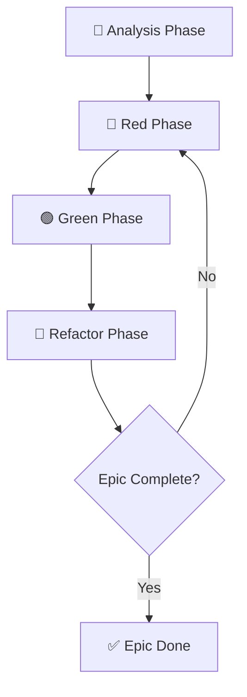

# 🧪 TDD Project Template

**Enhanced Test-Driven Development Template with Real-time Analytics and GitHub Integration**

[](https://opensource.org/licenses/MIT)
[](https://www.python.org/downloads/)
[](https://python-poetry.org/)
[](https://your-username.github.io/tdd-project-template)

> 🚀 **Professional TDD template** with Plotly-powered Gantt charts, automated GitHub Pages deployment, and real-time commit analytics.

## ✨ Features

### 🧪 **TDD Methodology Integration**
- **Red-Green-Refactor** cycle tracking with commit pattern parsing
- **Phase-based progress** monitoring (analysis → red → green → refactor)
- **TDD cycle completion** metrics and quality gates
- **Interactive commit helper** with TDD workflow guidance

### 📊 **Real-time Analytics Dashboard**
- **Interactive Gantt charts** powered by Plotly with dual-bar visualization
- **Time accuracy tracking** comparing estimated vs actual time spent
- **Performance grading** (A/B/C) based on time estimation accuracy
- **TDD cycle analytics** with completion rates and trend analysis

### 🤖 **GitHub Automation**
- **Automatic chart updates** on every commit with `[EPIC-X]` pattern
- **Jekyll + GitHub Pages** deployment with professional themes
- **Issue linking** connecting epics to GitHub issues automatically
- **Milestone tracking** with visual project timeline representation

### 🏗️ **Professional Template Structure**
- **Poetry dependency management** with graceful fallbacks
- **Modular architecture** with clean separation of concerns
- **Docker support** for containerized development
- **Pre-commit hooks** for code quality and consistency

## 🚀 Quick Start

### 1. **Use This Template**
```bash
# Create your repository from this template
gh repo create my-tdd-project --template your-username/tdd-project-template --public

# Clone and setup
git clone https://github.com/your-username/my-tdd-project.git
cd my-tdd-project
```

### 2. **Install Dependencies**
```bash
# Using Poetry (recommended)
poetry install

# Or using pip (fallback)
pip install -r requirements.txt
```

### 3. **Initialize Your Project**
```bash
# Interactive setup wizard
python scripts/init_project.py

# Or manual setup
cp config/environment/.env.example .env
# Edit .env with your project settings
```

### 4. **Start Your First TDD Cycle**
```bash
# Use the interactive commit helper
python scripts/commit_helper.py

# Example TDD workflow
git commit -m "[EPIC-1] analysis: docs: define user authentication requirements [Task 1.1 | 20min]"
git commit -m "[EPIC-1] red: test: add user login validation tests [Task 1.2 | 30min]"
git commit -m "[EPIC-1] green: feat: implement user login endpoint [Task 1.3 | 45min]"
git commit -m "[EPIC-1] refactor: refactor: extract validation middleware [Task 1.4 | 25min]"
```

### 5. **View Your Dashboard**
Your **GitHub Pages dashboard** will automatically be available at:
`https://your-username.github.io/your-repo-name`

## 📋 TDD Workflow

### Commit Pattern Format
```
[EPIC-X] phase: type: description [Task X.Y | Zmin]
```

### TDD Phases
- 🧪 **Analysis**: Requirements analysis and task planning
- 🔴 **Red**: Write failing tests first  
- 🟢 **Green**: Implement code to make tests pass
- 🔄 **Refactor**: Clean and optimize code

### Example Epic Flow


## 🛠️ Configuration

### Environment Setup
```bash
# Copy environment template
cp config/environment/.env.example .env

# Edit configuration
nano .env
```

### GitHub Pages Configuration
1. **Enable GitHub Pages** in your repository settings
2. **Select source**: GitHub Actions
3. **Configure secrets** (if needed for private repositories)

### Epic Management
```bash
# Create new epic
cp epics/template_epic.json epics/epic_1.json
# Edit epic details

# Validate epic format
python scripts/validate_epic.py epics/epic_1.json
```

## 📊 Analytics Dashboard

### Available Visualizations
- **📅 Interactive Gantt Chart**: Real-time progress with dual bars (planned vs actual)
- **🧪 TDD Phase Distribution**: Time spent in each TDD phase
- **📈 Epic Progress Timeline**: Completion trends over time
- **🎯 Performance Metrics**: Time accuracy and quality indicators

### Access Your Dashboard
- **Main Dashboard**: `https://your-username.github.io/your-repo`
- **Interactive Gantt**: `https://your-username.github.io/your-repo/tdd_gantt_progress.html`
- **Static Dashboard**: `https://your-username.github.io/your-repo/dashboard.html`

## 🧪 TDD Best Practices

### 1. **Start with Analysis**
Always begin each epic with the analysis phase to plan and understand requirements.

### 2. **Write Tests First** 
Follow the Red phase by writing failing tests that define the expected behavior.

### 3. **Minimal Implementation**
In the Green phase, write just enough code to make tests pass.

### 4. **Refactor Regularly**
Use the Refactor phase to improve code quality while maintaining functionality.

### 5. **Track Your Progress**
Use the commit helper and dashboard to monitor your TDD workflow efficiency.

## 🏗️ Project Structure

```
├── 📁 .github/workflows/     # GitHub Actions automation
├── 📁 config/               # Configuration files
│   ├── 📁 docker/           # Docker setup
│   ├── 📁 environment/      # Environment variables
│   └── 📁 vscode/          # VS Code settings
├── 📁 docs/                 # Jekyll documentation & dashboards
├── 📁 epics/               # Epic JSON definitions
├── 📁 scripts/             # Automation scripts
│   ├── 📁 visualization/    # Analytics and charts
│   └── commit_helper.py     # TDD commit assistant
├── 📁 tests/               # Test files
├── pyproject.toml          # Poetry configuration
├── requirements.txt        # Pip fallback
└── README.md              # This file
```

## 🐳 Docker Support

```bash
# Build development container
docker-compose -f config/docker/docker-compose.yml up -d

# Run TDD workflow inside container
docker exec -it tdd-project poetry run python scripts/commit_helper.py
```

## 🧑‍💻 Development

### Running Tests
```bash
# All tests
poetry run pytest

# With coverage
poetry run pytest --cov=scripts --cov-report=html

# TDD-specific tests
poetry run pytest -m tdd
```

### Code Quality
```bash
# Linting and formatting
poetry run ruff check .
poetry run ruff format .

# Type checking
poetry run mypy scripts/
```

### Setup Validation
```bash
# Validate template setup
python scripts/test_setup.py
```

## 🤝 Contributing

1. **Fork** this repository
2. **Create** a feature branch (`git checkout -b feature/amazing-feature`)
3. **Follow TDD methodology** for all changes
4. **Commit** using the TDD pattern (`[EPIC-X] phase: type: description`)
5. **Push** to your branch (`git push origin feature/amazing-feature`)
6. **Open** a Pull Request

### Contribution Guidelines
- Follow the established TDD commit patterns
- Include tests for all new features
- Update documentation for significant changes
- Ensure all quality checks pass

## 📚 Documentation

- **[Setup Guide](./SETUP_GUIDE.md)** - Detailed installation and configuration
- **[TDD Commit Patterns](./docs/TDD_COMMIT_PATTERNS.md)** - Complete guide to TDD workflow
- **[Customization Guide](./CUSTOMIZATION.md)** - Adapt template to your needs
- **[Troubleshooting](./TROUBLESHOOTING.md)** - Common issues and solutions
- **[GitHub Pages Setup](./docs/github_pages_setup_guide.md)** - Dashboard deployment

## 🌟 Inspiration

This template was inspired by the **ETL Debrito project** and incorporates proven patterns for:
- Real-time project analytics
- Professional GitHub Pages dashboards
- Automated workflow integration
- TDD methodology best practices

## 📄 License

This project is licensed under the **MIT License** - see the [LICENSE](LICENSE) file for details.

## 🙏 Acknowledgments

- **[ETL Debrito Project](https://github.com/davidcantidio/etl_debrito)** - Original analytics and dashboard architecture
- **[Plotly](https://plotly.com/python/)** - Interactive visualization framework
- **[Jekyll](https://jekyllrb.com/)** - Static site generation for GitHub Pages
- **TDD Community** - Methodology and best practices

---

<div align="center">

**🚀 Ready to supercharge your TDD workflow?**

[📝 Use This Template](https://github.com/your-username/tdd-project-template/generate) • [📊 View Demo Dashboard](https://your-username.github.io/tdd-project-template) • [📚 Read the Docs](https://your-username.github.io/tdd-project-template)

Made with ❤️ for the TDD community

</div>