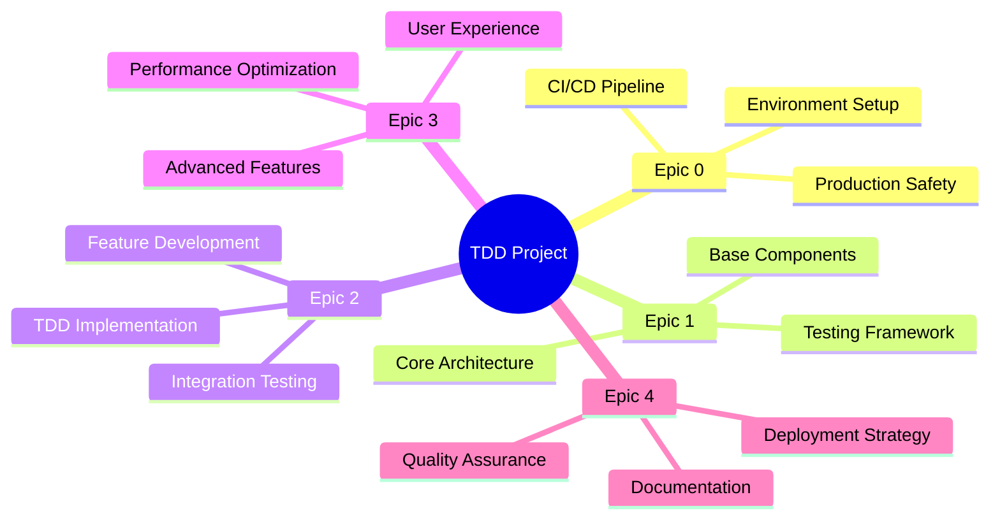
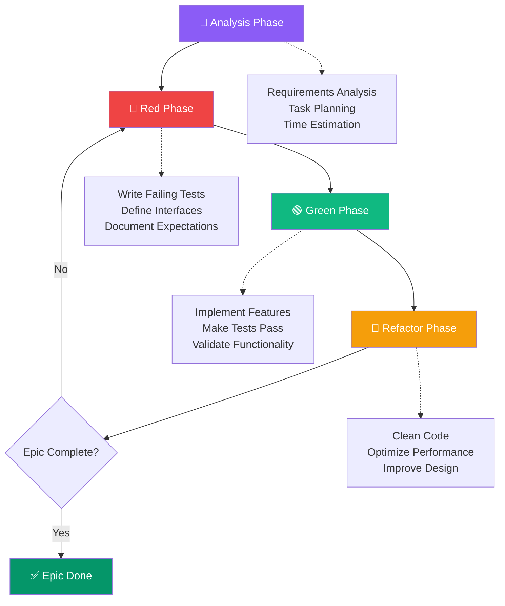
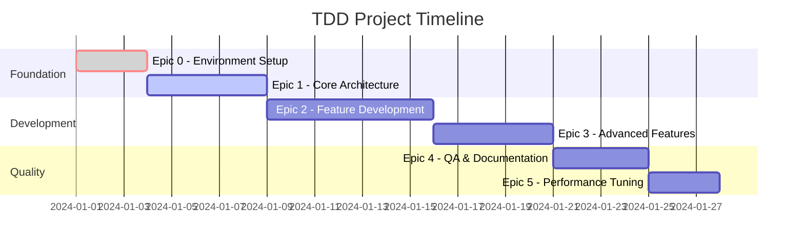

# 🧪 TDD Project Template Dashboard

Welcome to the **Enhanced TDD Project Template** - a comprehensive solution for Test-Driven Development with real-time analytics, interactive Gantt charts, and seamless GitHub integration.

<div style="text-align: center; margin: 30px 0;">
  <a href="./tdd_gantt_progress.html" style="display: inline-block; background: linear-gradient(135deg, #667eea 0%, #764ba2 100%); color: white; padding: 12px 24px; border-radius: 8px; text-decoration: none; font-weight: bold; margin: 10px;">
    🎯 Interactive TDD Gantt Dashboard
  </a>
</div>

## 🚀 Project Overview

This template combines **Test-Driven Development methodology** with **modern project management tools**, providing:

- 📊 **Real-time TDD Progress Tracking**
- 🧪 **Red-Green-Refactor Cycle Monitoring**  
- 📅 **Interactive Gantt Charts with Plotly**
- 🤖 **Automated GitHub Pages Deployment**
- 📈 **Performance Analytics & Time Tracking**

## 📋 Epic Structure Overview



## 🔄 TDD Workflow Integration

Our template follows the classic TDD workflow with enhanced tracking:



## 🎯 Features & Capabilities

### 📊 Enhanced Analytics
- **Time Accuracy Tracking**: Compare estimated vs actual time spent
- **TDD Cycle Completion**: Monitor Red-Green-Refactor cycles per epic
- **Performance Grading**: A/B/C grades based on time accuracy
- **Commit Pattern Analysis**: Automatic parsing of TDD phase commits

### 🧪 TDD-Specific Tools
- **Phase-based Progress**: Track progress through analysis → red → green → refactor
- **Cycle Completion Metrics**: Monitor complete TDD cycles per epic
- **Quality Gates**: Ensure proper TDD methodology adherence
- **Automated Testing Integration**: CI/CD pipeline with test automation

### 🤖 GitHub Integration
- **Automatic Chart Updates**: Gantt charts update on every commit
- **Issue Linking**: Connect epics to GitHub issues automatically
- **Milestone Tracking**: Visual representation of project milestones
- **Pull Request Analytics**: Track development velocity and quality

## 📈 Real-time Progress Tracking



## 🔧 Quick Start Guide

1. **Clone the template**:
   ```bash
   git clone https://github.com/your-username/tdd-project-template.git
   cd tdd-project-template
   ```

2. **Install dependencies**:
   ```bash
   pip install -r requirements.txt
   bundle install  # For Jekyll (in docs/ directory)
   ```

3. **Initialize your project**:
   ```bash
   python setup/init_tdd_project.py --project-name "My TDD Project"
   ```

4. **Start development**:
   ```bash
   # Make your first TDD commit
   git commit -m "[EPIC-1] red: feat: initial failing test [Task 1.1 | 30min]"
   ```

## 📊 Live Dashboard

Access your **[Interactive TDD Dashboard](./tdd_gantt_progress.html)** for:

- 📈 **Real-time metrics** and progress analytics
- 🧪 **TDD cycle visualization** with dual-bar charts  
- 🎯 **Time accuracy tracking** and performance grades
- 📋 **Epic breakdown** with task-level details
- 🔄 **Commit history analysis** and trend monitoring

## 🌐 GitHub Pages Features

This dashboard is **automatically updated** via GitHub Actions whenever you:

- Push commits with `[EPIC-X]` pattern
- Create/update issues linked to epics
- Reach project milestones
- Merge pull requests

## 📚 Documentation

- [Setup Guide](./SETUP_GUIDE.html) - Complete installation and configuration
- [TDD Methodology](./docs/tdd-methodology.html) - Best practices and guidelines
- [Customization Guide](./CUSTOMIZATION.html) - Adapt the template to your needs
- [Troubleshooting](./TROUBLESHOOTING.html) - Common issues and solutions

---

<div style="text-align: center; margin: 40px 0; padding: 20px; background: linear-gradient(135deg, #f8fafc 0%, #e2e8f0 100%); border-radius: 12px;">
  <h3 style="color: #1e293b; margin-bottom: 15px;">🚀 Ready to Start Your TDD Journey?</h3>
  <p style="color: #64748b; margin-bottom: 20px;">
    Experience the power of Test-Driven Development with real-time analytics and beautiful visualizations.
  </p>
  <a href="https://github.com/your-username/tdd-project-template/generate" style="display: inline-block; background: #3b82f6; color: white; padding: 12px 24px; border-radius: 8px; text-decoration: none; font-weight: bold;">
    📝 Use This Template
  </a>
</div>

**Last updated**: {{ site.time | date: "%B %d, %Y at %H:%M UTC" }}  
**Generated by**: TDD Project Template with ❤️ and GitHub Pages